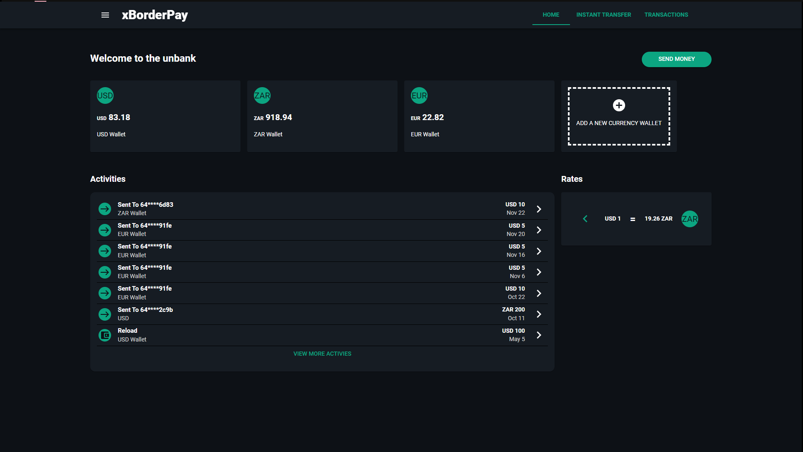
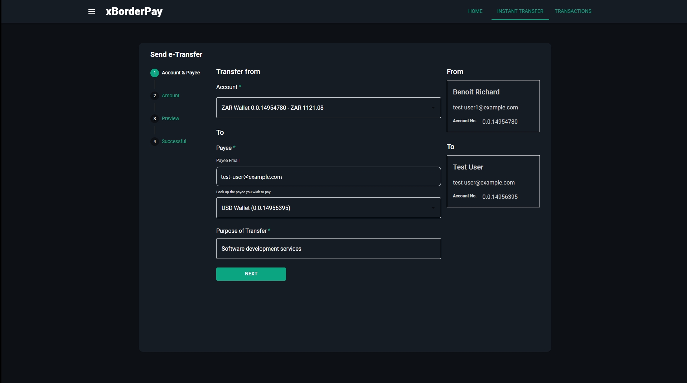
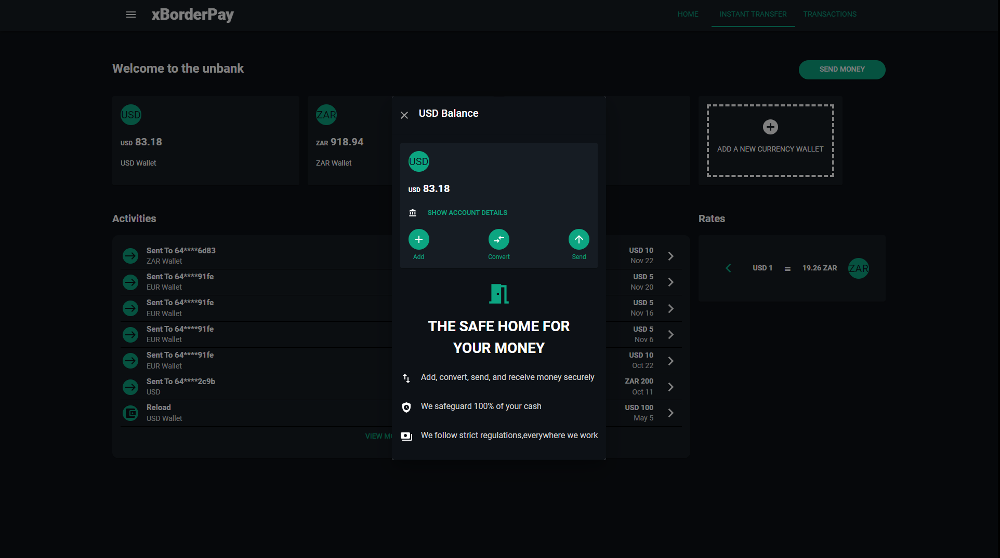
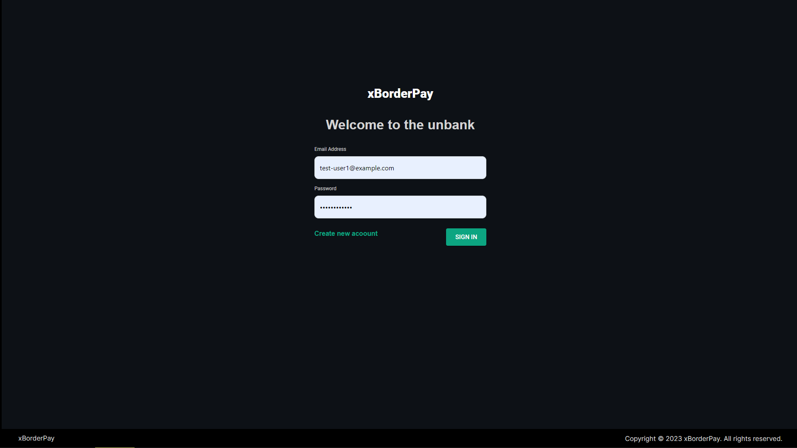
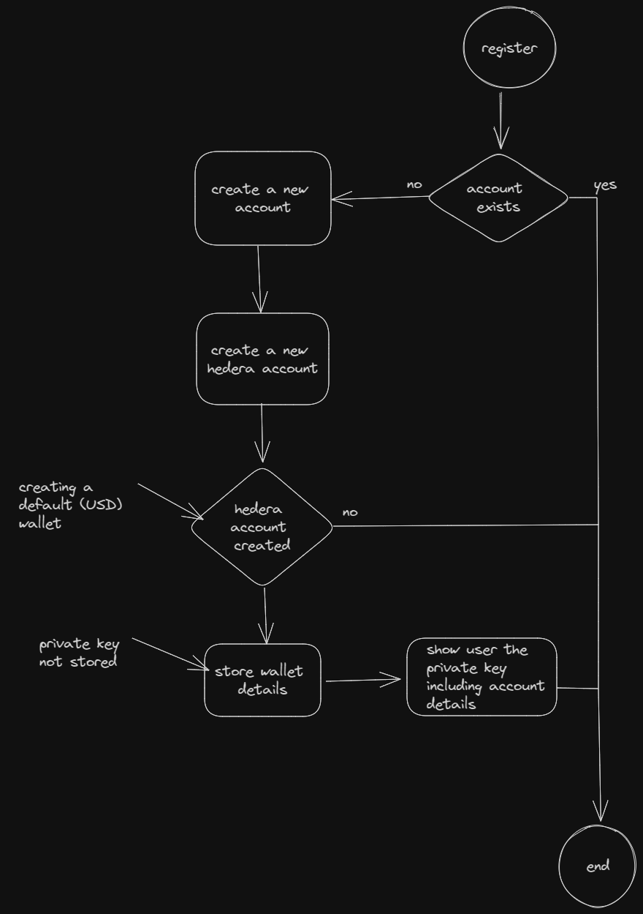
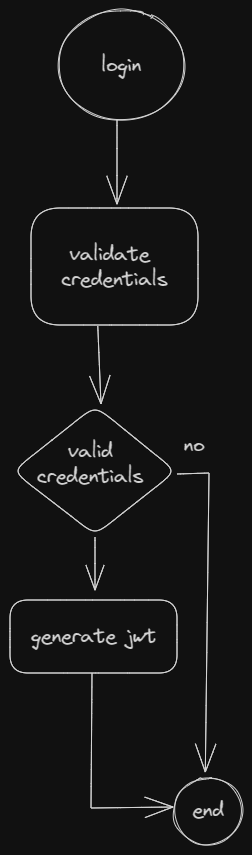
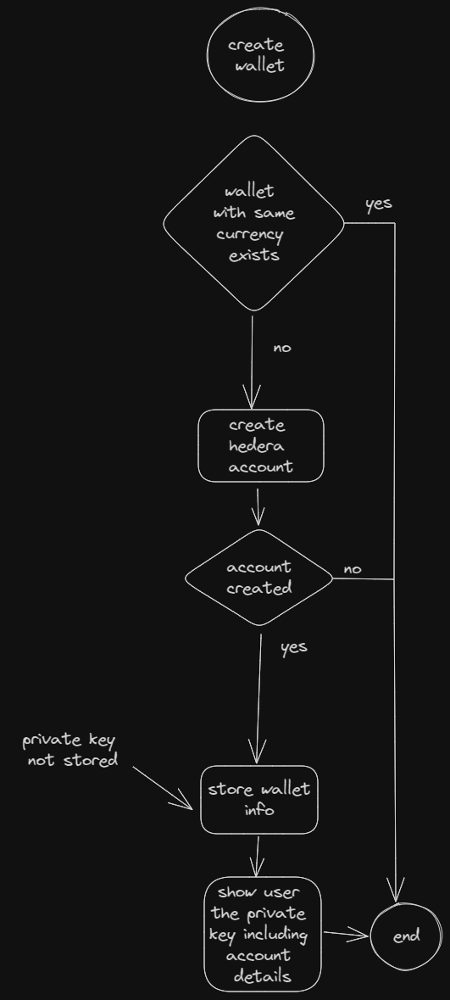
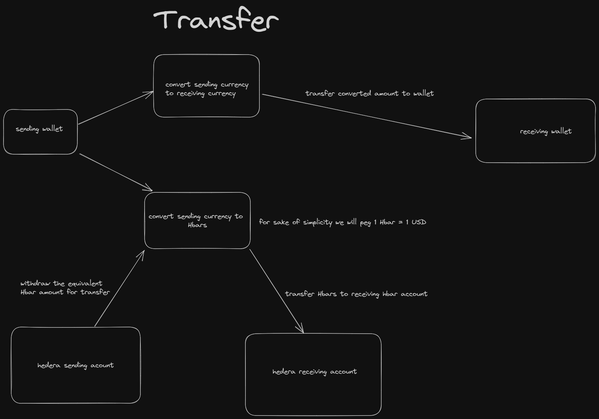

# xborderpay

xBorderPay (Cross Border Payment) is a cross-border payment platform built on Hedera's trusted DLT technology. 

Our project aims to leverage the speed, efficiency, and reliability of Hedera's Hashgraph to revolutionize international payments, catering to the needs of individuals and businesses in the rapidly evolving fintech industry.

## Demo! & Gallery

visit: <a href="https://xborderpay.vercel.app/" target="_blank">https://xborderpay.vercel.app/</a>


<table>
  <tr>
     <td> </td>
     <td>  </td>
     <td>  </td>
     <td>  </td>
  </tr>
  

</table>

### Features

- **Authentication:** user can register, login, signout
- **Wallet Creation:** to add wallet in other currencies
- **Wallet Topup:** to add funds to wallet
- **Wallet Deletion:** to delete wallet
- **Instant Cross-Border Payments:** xBorderPay provide near-instantaneous settlement of cross-border transactions. Leveraging Hedera's fast and secure DLT, we offer a reliable payment infrastructure that eliminates the delays and complexities associated with traditional banking systems.
- **Seamless User Experience:** xBorderPay prioritize a seamless user experience by offering a user-friendly interface and intuitive payment flow. Users can easily initiate and track transactions, view transaction history, and manage their digital wallets.
- **Scalability and Interoperability:** Built on Hedera's scalable DLT technology, xBorderPay can handle high transaction volumes with minimal latency.

### Benefits and Impact:

- **Speed and Efficiency:** xBorderPay utilization of Hedera's trusted DLT technology ensures fast and efficient cross-border payments, reducing settlement times from days to seconds.
- **Cost Reduction:** By optimizing payment routing and minimizing fees and foreign exchange costs, xBorderPay offers significant cost savings for individuals and businesses conducting international transactions.
- **Global Accessibility:** xBorderPay enables financial inclusion by providing individuals and businesses worldwide with access to fast and reliable cross-border payment services, regardless of their geographical location or banking infrastructure.
- **Trust and Security:** Leveraging Hedera's robust DLT technology, xBorderPay ensures secure and tamper-proof transactions, maintaining the integrity and privacy of user data.
- **Industry Adoption:** With Hedera's DLT technology trusted by major fintech companies around the world, xBorderPay has the potential to gain significant adoption and become a preferred choice for cross-border payment solutions.

xBorderPay aims to disrupt the cross-border payment industry by leveraging the power of Hedera's trusted DLT technology. By providing a fast, efficient, and secure platform, we enable individuals and businesses to conduct seamless international transactions, fostering financial inclusion, and driving innovation in the fintech landscape.

## Getting Started
Before running the project we will need to prepare our environment with the following:

- [Nodejs](https://nodejs.org/en/download)
- [pnpm](https://pnpm.io/installation)
- A free [Open Exchange Rates](https://openexchangerates.org/) api key
- a local [MongoDb](https://www.mongodb.com/docs/manual/installation/) instance or a cloud [MongoDb Atlas](https://www.mongodb.com/atlas) connection string
- A [Hedera test net account](https://docs.hedera.com/hedera/getting-started/environment-set-up)

Once you have setup the above, you can go ahead an rename [example.env](./example.env) in the repository to `.env`.

| Environment variable |                                                 |
| -------------------- | ----------------------------------------------- |
| MONGO_URL            | mongodb url or atlas url/connection string      |
| MONGO_USER           | database user that has access to the `MONGO_DB` |
| MONGO_PASSWORD       | database user password                          |
| MONGO_DB             | the name of the database to be used             |
| JWT_SECRET           | secret used to sign jwt tokens                  |
| JWT_ISSUER           | jwt issuer, default `xborderpay`                |
| JWT_AUDIENCE         | jwt audience `xborderpay`                       |
| RATES_API_KEY        | open change rates api key                       |
| HEDERA_ACCOUNT_ID    | hedera test net account id                      |
| HEDERA_PRIVATE_KEY   | hedera test net account private key             |


First install the node modules
```bash
pnpm i
```

Then you can run the dev build with
```bash
pnpm dev
```
The above command should start the project on port `3000` and the api and web interface can be accessed on the url [http://localhost:3000](http://localhost:3000)

## Deployment

We have chosen to deploy the project on vercel. However, since the project is built using nodejs, it can be deployed in any environment nodejs is allowed to run.
You will need to however build an optimized production build using `pnpm build`, after which you can use `pnpm start` to run the production build.

## System Diagram
<table>
  <tr>
     <td>
     <p>Register</p>
     
    </td>
     <td>
     <p>Login</p>
     
    </td>
     <td>
     <p>Create Wallet</p>
     
    </td>
     <td>
     <p>Transfer Process</p>
     
    </td>
  </tr>
  

</table>